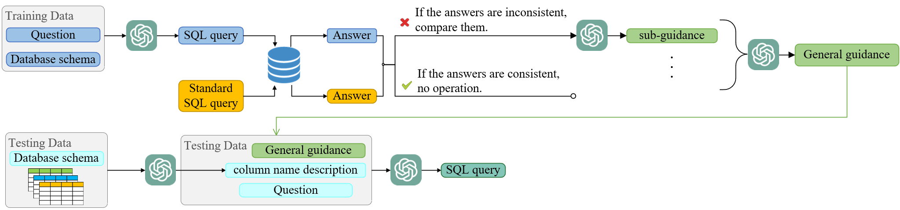

# 🎉 Learn From Mistakes: Guidance on Zero-shot Conversational Text-to-SQL

[](https://www.python.org/)

This is the code for the manuscript "Learn From Mistakes: Guidance on Zero-shot Conversational Text-to-SQL". (Zhai et al., CIKM 2024)🏆. Here we also show the key prompts and general guidance of our paper.

#### ✨Architecture
Our method derives general guidance through the analysis of error cases in the training data. Subsequently, this general guidance is applied to the test data, leveraging CoT.
<br>
<div align="center">

</div>
<br>

🤗Datasets Link: https://drive.google.com/uc?export=download&id=1Y3ydpFiQQ3FC0bzdfy3groV95O_f1nXF

🏅Leaderboard Link: https://yale-lily.github.io/cosql

## 📖Prompts
Some example prompts are shown here.
### Database Schema Prompt

```
### Given the following database schema, your job is 
to write queries given a user’s request and with no 
explanation.  
# CREATE TABLE "continents" (
"ContId" INTEGER PRIMARY KEY,
"Continent" TEXT);
# CREATE TABLE "countries" ( 
"CountryId" INTEGER PRIMARY KEY,
"CountryName" TEXT,
"Continent" INTEGER,
FOREIGN KEY (Continent) REFERENCES continents(ContId));
# CREATE TABLE "car\_makers" (
"Id" INTEGER PRIMARY KEY,
"Maker" TEXT,
"FullName" TEXT,
"Country" TEXT,
FOREIGN KEY (Country) REFERENCES countries(CountryId));
# CREATE TABLE "model\_list" (
"ModelId" INTEGER PRIMARY KEY,
"Maker" INTEGER,
"Model" TEXT UNIQUE,
FOREIGN KEY (Maker) REFERENCES car\_makers (Id));
# CREATE TABLE "car\_names" (
"MakeId" INTEGER PRIMARY KEY,
"Model" TEXT,
"Make" TEXT,
FOREIGN KEY (Model) REFERENCES model\_list (Model));
# CREATE TABLE "cars\_data" (
"Id" INTEGER PRIMARY KEY,
"MPG" TEXT,
"Cylinders" INTEGER,
"Edispl" REAL,
"Horsepower" TEXT,
"Weight" INTEGER,
"Accelerate" REAL, 
"Year" INTEGER,
FOREIGN KEY (Id) REFERENCES car\_names (MakeId));
```

### Column Semantic Inference Prompt

The sample tabular data representation format is in json format as an example.

```
### Given the following database schema and the first three rows of data from each table as reference, your job is to infer the semantics of table and column to ensure correct table joins based on relationships defined in the database schema.
# CREATE TABLE "continents" (
"ContId" INTEGER PRIMARY KEY,
"Continent" TEXT);
# CREATE TABLE "countries" ( 
"CountryId" INTEGER PRIMARY KEY,
"CountryName" TEXT,
"Continent" INTEGER,
FOREIGN KEY (Continent) REFERENCES continents(ContId));
# CREATE TABLE "car\_makers" (
"Id" INTEGER PRIMARY KEY,
"Maker" TEXT,
"FullName" TEXT,
"Country" TEXT,
FOREIGN KEY (Country) REFERENCES countries(CountryId));
# CREATE TABLE "model\_list" (
"ModelId" INTEGER PRIMARY KEY,
"Maker" INTEGER,
"Model" TEXT UNIQUE,
FOREIGN KEY (Maker) REFERENCES car\_makers (Id));
# CREATE TABLE "car\_names" (
"MakeId" INTEGER PRIMARY KEY,
"Model" TEXT,
"Make" TEXT,
FOREIGN KEY (Model) REFERENCES model\_list (Model));
# CREATE TABLE "cars\_data" (
"Id" INTEGER PRIMARY KEY,
"MPG" TEXT,
"Cylinders" INTEGER,
"Edispl" REAL,
"Horsepower" TEXT,
"Weight" INTEGER,
"Accelerate" REAL, 
"Year" INTEGER,
FOREIGN KEY (Id) REFERENCES car\_names (MakeId));
## We selected the first three rows of data from each
table as reference, as follows: 
# TABLE "continents": 
{"ContId":{"0":1,"1":2,"2":3},
 "Continent":{"0":"america","1":"europe","2":"asia"}}
# TABLE "countries": 
{"CountryId":{"0":1,"1":2,"2":3},
 "CountryName":{"0":"usa","1":"germany","2":"france"},
 "Continent":{"0":1,"1":2,"2":2}}
# TABLE "car_makers": 
{"Id":{"0":1,"1":2,"2":3},
 "Maker":{"0":"amc","1":"volkswagen","2":"bmw"},
 "FullName":{"0":"American Motor Company",
	        "1":"Volkswagen","2":"BMW"},
 "Country":{"0":"1","1":"2","2":"2"}}
# TABLE "model_list": 
{"ModelId":{"0":1,"1":2,"2":3},
 "Maker":{"0":1,"1":2,"2":3},
 "Model":{"0":"amc","1":"audi","2":"bmw"}}
# TABLE "car_names": 
{"MakeId":{"0":1,"1":2,"2":3},
 "Model":{"0":"chevrolet","1":"buick","2":"plymouth"},
 "Make":{"0":"chevrolet chevelle malibu",
 	     "1":"buick skylark 320","2":"plymouth satellite"}}
# TABLE "cars_data": 
{"Id":{"0":1,"1":2,"2":3},
 "MPG":{"0":"18","1":"15","2":"18"},
 "Cylinders":{"0":8,"1":8,"2":8},
 "Edispl":{"0":307.0,"1":350.0,"2":318.0},
 "Horsepower":{"0":"130","1":"165","2":"150"},
 "Weight":{"0":3504,"1":3693,"2":3436},
 "Accelerate":{"0":12.0,"1":11.5,"2":11.0},
 "Year":{"0":1970,"1":1970,"2":1970}}
```

### Prompt for Learning from Mistakes and Getting General Guidance

```
##### Next, some error examples and corresponding guiding suggestions will be given. Your task is to integrate these scattered recommendations into a comprehensive and concise overarching guiding principle. Please try to categorize these suggestions by similarity or logical order to better organize the information. Remember, the goal is to create a general guidance recommendation that is easy to understand and apply, which will serve as the basis for decisions and actions.
```

```
##### Next, some guiding suggestions will be given. Your task is to integrate these scattered recommendations into a comprehensive and concise overarching guiding principle. Please try to categorize these suggestions by similarity or logical order to better organize the information. Remember, the goal is to create a general guidance recommendation that is easy to understand and apply, which will serve as the basis for decisions and actions.
```

## 🚀General Guidance

This is the general guidance obtained by learning from mistakes.

```
### You must follow these rules:
1. To ensure that the conditions in the WHERE clause match accurately, fuzzy matching should be used when generating the query. Use the correct operator for exact matches (e.g., '=') and LIKE with wildcard characters (\%) for partial matches especially searching for patterns.
2. When using GROUP BY and HAVING clauses, reference aggregate functions directly rather than using aliases defined in the SELECT statement. Be cautious when using aliases in the ORDER BY clause; some databases may not support referencing aliases directly.
3. Verify that JOIN conditions are based on correct columns to establish accurate relationships. Avoid unnecessary keywords like DISTINCT in subqueries unless essential for the query's purpose.
4. When using aggregate functions like AVG, ensure the conditions in the HAVING clause accurately reflect the intended logic. When using aggregate functions like COUNT, ensure they align with the grouping criteria to avoid incorrect results.
5. Maintain consistency in representing boolean values in SQL queries to avoid confusion and errors. Use the appropriate boolean representation(e.g., "True", "False") . Use IS NULL or IS NOT NULL conditions to handle NULL values appropriately in queries. Be cautious with floating-point numbers, consider precision, and use appropriate comparison methods to avoid errors. Avoid unnecessary modifiers like DISTINCT when selecting unique values or columns that are already unique.
```

The Performance of Each Item directly as prompt is as follows:

||VA|QEM|IEM|QEX|IEX|
|---|---|---|---|---|---|
|general guidance|93.8|9.4|6.7|65.6|40.0|
|w/o 1st item|95.8|12.5|3.3|65.6(-)|36.7(↓)|
|w/o 2nd item|93.8|11.5|0.0|63.5(↓)|36.7(↓)|
|w/o 3rd item|92.7|9.4|6.7|<b>67.7(↑)|<b>46.7(↑)|
|w/o 4th item|94.8|11.5|6.7|60.4(↓)|40.0(-)|
|w/o 5th item|93.8|11.5|6.7|63.5(↓)|40.0(-)|

Therefore, the third item is not suitable as a prompt directly. This item involves the inability of LLMs to effectively associate column names. To enhance LLMs' comprehension of the table's column names, we introduced a CoT aimed at enabling LLMs  to interpret the semantics embedded within these column names. 
